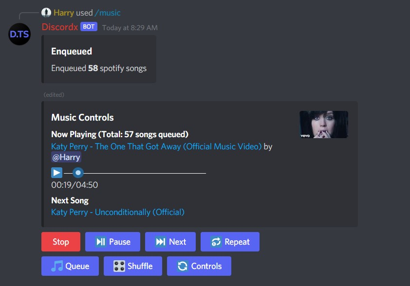
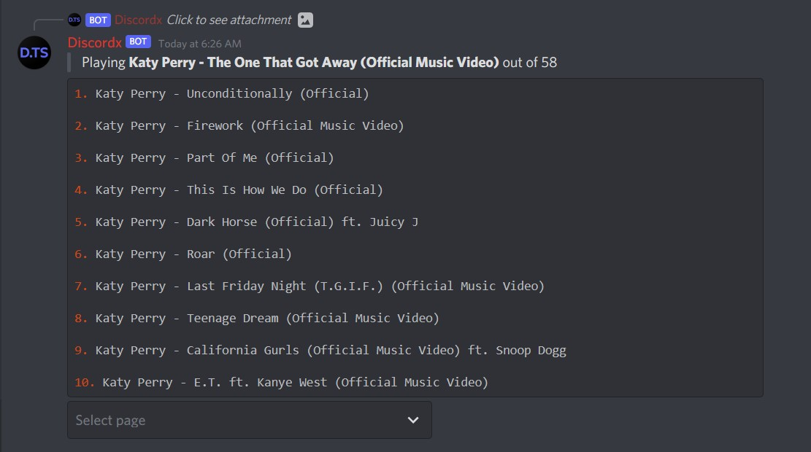

# Discord Music Bot

Example of music bot with [discordx](https://www.npmjs.com/package/discordx)

Try on [CodeSandbox](https://codesandbox.io/s/github/oceanroleplay/discord-music-bot)

# Installation

- `git clone https://github.com/oceanroleplay/discord-music-bot`
- `cd discord-music-bot`
- `npm install`
- `npm run build`
- `set BOT_TOKEN=<your bot token>`

  if you don't have token yet than create one at [discord developer portal](https://discord.com/developers/)

- `npm run start`

# ☎️ Need help?

Ask in **[discord server](https://discord.gg/yHQY9fexH9)** or open a **[issue](https://github.com/oceanroleplay/discord-music-bot/issues)**

# Thank you

Show your support for [discordx](https://www.npmjs.com/package/discordx) by giving us a star on [github](https://github.com/oceanroleplay/discord.ts).
